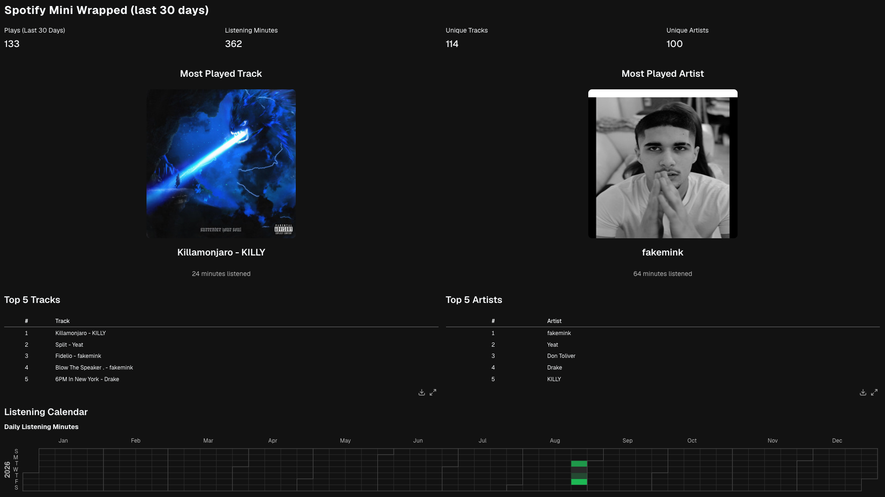

# Spotify Listening Analytics Platform

An end-to-end personal analytics platform that collects Spotify listening data,
stores the raw API responses in Snowflake, transforms them with dbt, schedules
the pipeline with Airflow, and presents a mini wrapped-style dashboard in
Evidence.



## Architecture

```text
                         +----------------+
                         | Apache Airflow |
                         | hourly schedule|
                         +-------+--------+
                                 |
                                 v
+-------------+    +----------------------+    +-----------------------+
| Spotify API | -> | Python ingestion     | -> | Snowflake RAW         |
| OAuth       |    | fetch and load       |    | JSON in VARIANT       |
+-------------+    +----------------------+    +-----------+-----------+
                                                           |
                                                           v
                                               +-----------------------+
                                               | dbt transformations   |
                                               | staging and marts     |
                                               +-----------+-----------+
                                                           |
                                                           v
                                               +-----------------------+
                                               | Snowflake ANALYTICS   |
                                               | facts and reports     |
                                               +-----------+-----------+
                                                           |
                                                           v
                                               +-----------------------+
                                               | Evidence dashboard    |
                                               |                       |
                                               +-----------------------+
```

The pipeline collects:

- recently played tracks from the last 14 days
- saved tracks
- short-term top tracks and artists
- followed artists

Raw responses are retained as Snowflake `VARIANT` values. dbt turns them into
staging views, dimensions, facts, and reporting tables consumed by the Evidence
dashboard.

## Tech stack

- Python
- Snowflake
- dbt
- Apache Airflow
- Evidence
- Apple container

## Project structure

```text
.
├── airflow/              # Airflow image and DAG
├── evidence/             # Mini Wrapped dashboard
├── scripts/              # Airflow and Evidence helper commands
├── spotify_analytics/    # dbt project
├── src/
│   ├── ingestion/        # Spotify pagination and collection
│   ├── spotify/          # API client and OAuth
│   └── warehouse/        # Snowflake setup and raw loading
└── main.py               # Run ingestion without Airflow
```

## Prerequisites

- macOS with [Apple container](https://github.com/apple/container)
- a Spotify developer application
- a Snowflake account and warehouse
- Python 3.14 and [uv](https://docs.astral.sh/uv/) for running locally
- the [Evidence CLI](https://docs.evidence.dev/core-concepts/development/cli/)
  for the dashboard

## Configuration

Copy the environment template:

```shell
cp .env.example .env
```

Then set:

```dotenv
SPOTIFY_CLIENT_ID=
SPOTIFY_CLIENT_SECRET=
SPOTIFY_REDIRECT_URI=

SNOWFLAKE_ACCOUNT=
SNOWFLAKE_USER=
SNOWFLAKE_PASSWORD=
SNOWFLAKE_WAREHOUSE=
SNOWFLAKE_ROLE=

AIRFLOW_USERNAME=
AIRFLOW_PASSWORD=
```

## Run with Airflow

Build the image and initialize Spotify OAuth once:

```shell
./scripts/build-airflow
./scripts/spotify-auth
```

The OAuth command prints an authorization URL. Open it, approve access, and
paste the full redirected URL back into the terminal.

Start Airflow:

```shell
./scripts/airflow-up
```

Open [http://localhost:8080](http://localhost:8080) and sign in with
`AIRFLOW_USERNAME` and `AIRFLOW_PASSWORD` from `.env`.

The `spotify_dag` DAG runs hourly. It creates the Snowflake source tables,
fetches and loads each Spotify source, builds the dbt models, and runs dbt
tests.

The DAG directory is bind-mounted, so DAG edits are detected without rebuilding
the image. Rebuild after changing Python dependencies, ingestion code, or dbt
models:

```shell
./scripts/build-airflow
./scripts/airflow-down
./scripts/airflow-up
```

Stop Airflow with:

```shell
./scripts/airflow-down
```

Airflow metadata, logs, and the Spotify OAuth cache remain in named volumes.
Restart Airflow with `airflow-down` followed by `airflow-up` after changing its
credentials.

## Run locally

Install the Python and dbt dependencies:

```shell
uv sync --dev
uv run dbt deps --project-dir spotify_analytics --profiles-dir spotify_analytics
```

Run ingestion directly:

```shell
uv run python main.py
```

Build and test the analytics models:

```shell
uv run --env-file .env dbt build \
  --project-dir spotify_analytics \
  --profiles-dir spotify_analytics
```

On the first local ingestion run, Spotify OAuth asks you to authorize in the
same way as the Airflow setup.

The current dbt profile reads the Snowflake account, user, and password from the
environment, but uses `ACCOUNTADMIN` and `COMPUTE_WH` as its role and warehouse.
Update `spotify_analytics/profiles.yml` if your Snowflake setup uses different
names.

## Dashboard

Start the Evidence development server from the repository root:

```shell
./scripts/evidence dev
```

Evidence reads Snowflake credentials from the root `.env` file and connects to
the `SPOTIFY_ANALYTICS` database. Useful checks:

```shell
./scripts/evidence tables
./scripts/evidence query "select current_version()"
./scripts/evidence validate
```

You can also run `npm run dev` from `evidence/`; its package scripts use the
same wrapper and environment loading.

## Data model

The dbt project uses:

- `stg_spotify__*` views to extract typed fields from raw JSON
- intermediate models to deduplicate and combine Spotify sources
- dimensions for artists, albums, and tracks
- a listening-history fact and track-artist bridge
- reporting tables for the 30-day mini Wrapped, top artists, top tracks, and
  daily listening calendar
